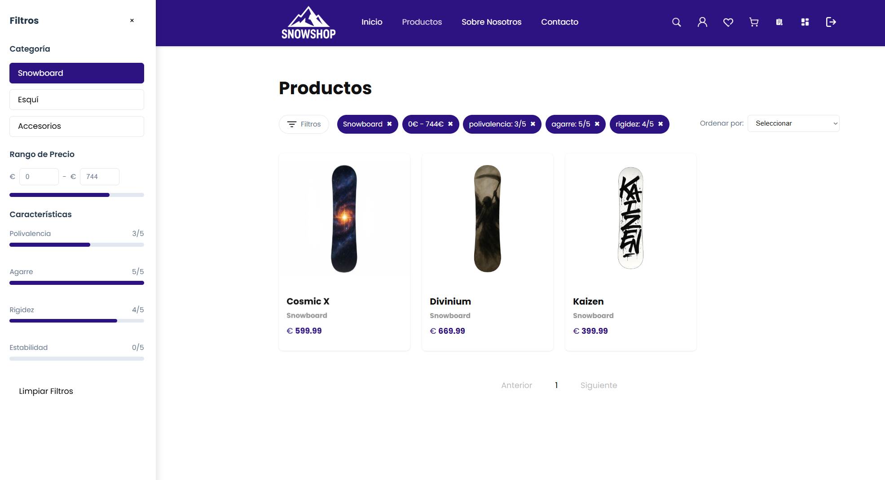
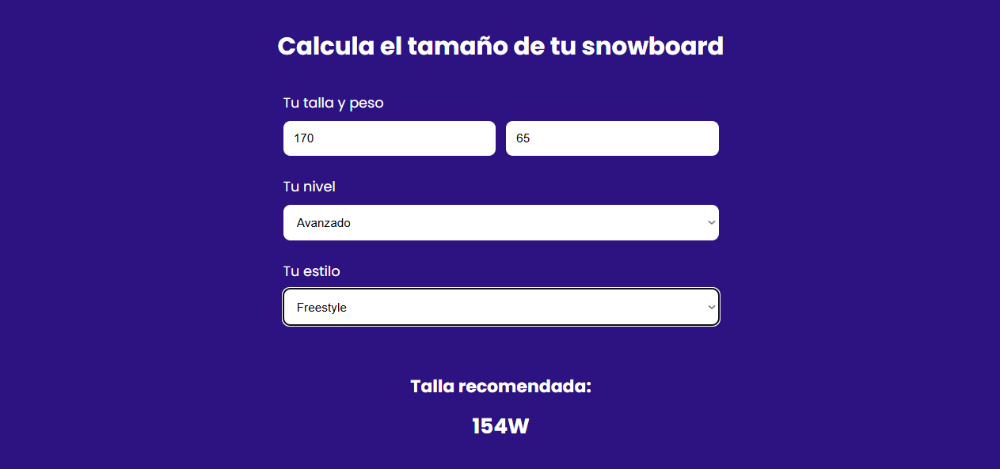

# SnowShop 


**E-commerce especializado en equipamiento de deportes de invierno**

Una plataforma completa de comercio electrónico desarrollada con Spring Boot y React.

## Tabla de Contenido
- [Instalación](#instalación)
- [Características principales](#características-principales)
- [Capturas de pantalla](#capturas-de-pantalla)
- [Tecnologías utilizadas](#tecnologías-utilizadas)
- [Requisitos previos](#requisitos-previos)
- [Estructura del proyecto](#estructura-del-proyecto)
- [Autor](#autor)

## Instalación

### 1. Frontend

```
git clone https://github.com/Jorgepr02/proyectoDAW
cd frontend/proyecto-react
npm install
npm run dev
```

### 1. Backend

Ejecutar Application.java


##  Características principales

###  **E-commerce Completo**
- Catálogo de productos con filtros avanzados por categoría, precio y características
- Sistema de carrito de compras persistente
- Checkout integrado con pasarela de pago Stripe
- Gestión de pedidos en tiempo real

###  **Gestión de Usuarios**
- Registro e inicio de sesión seguro con JWT
- Sistema de roles (Usuario/Administrador)
- Lista de deseos personalizada
- Historial de pedidos

###  **Especialización en Deportes de Invierno**
- Calculadora de tallas para snowboards
- Sistema de características técnicas (polivalencia, agarre, rigidez, estabilidad)
- Productos relacionados y recomendaciones
- Catálogo especializado: tablas de snowboard, esquís y accesorios

###  **Panel de Administración**
- Dashboard con métricas en tiempo real
- Gestión completa de productos (CRUD) y usuarios
- Administración de pedidos
- Gráficos de ventas y estadísticas

### **Responsive Design**
- Diseño adaptativo para móviles, tablets y escritorio
- Interfaz moderna y intuitiva
- Experiencia de usuario optimizada

##  Capturas de pantalla

### Página de Inicio


### Catálogo de Productos



### Panel de Administración


### Carrito de Compras


### Calculadora de Tallas


##  Tecnologías utilizadas

### Backend
- **Spring Boot** - Framework principal
- **Spring Security** - Autenticación y autorización
- **Spring Data JPA** - Persistencia de datos
- **MySQL** - Base de datos
- **JWT** - Tokens de autenticación
- **Stripe API** - Pasarela de pagos
- **Maven** - Gestión de dependencias

### Frontend
- **React** - Biblioteca de UI
- **React Router** - Enrutamiento
- **Chart.js** - Gráficos y visualizaciones
- **CSS Modules** - Estilos modulares
- **Vite** - Build tool

### Infraestructura
- **Cloudinary** - Gestión de imágenes

## Requisitos previos

### Software necesario:
- **Java 21** o superior
- **Node.js 18** o superior
- **MySQL 8.0** o superior
- **Maven 3.6** o superior
- **Git**

### Cuentas externas:
- Cuenta de **Stripe** (para pagos)


## Estructura del proyecto

```
proyectoDAW/
├── edu.jorge.proyectodaw/
│   ├── src/main/java/
│   │   ├── controller/  
│   │   ├── service/     
│   │   ├── entity/      
│   │   ├── repositories/
│   │   ├── security/    
│   │   └── config/      
│   ├── src/main/resources/
│   │   ├── application.yml
│   │   └── db/          
│   └── pom.xml          
├── frontend/proyecto-react/
│   ├── src/
│   │   ├── components/  
│   │   ├── pages/       
│   │   ├── styles/      
│   │   └── utils/       
│   ├── public/          
│   └── package.json     
└── README.md
```

## Autor

Jorge Pampín Ríos
